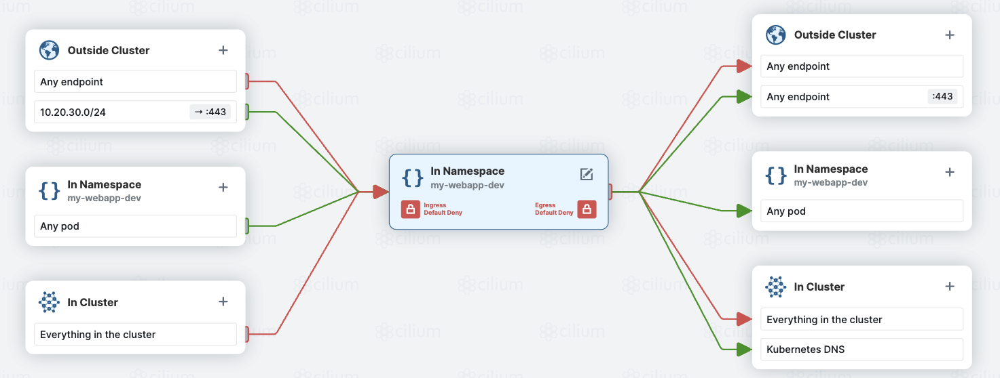
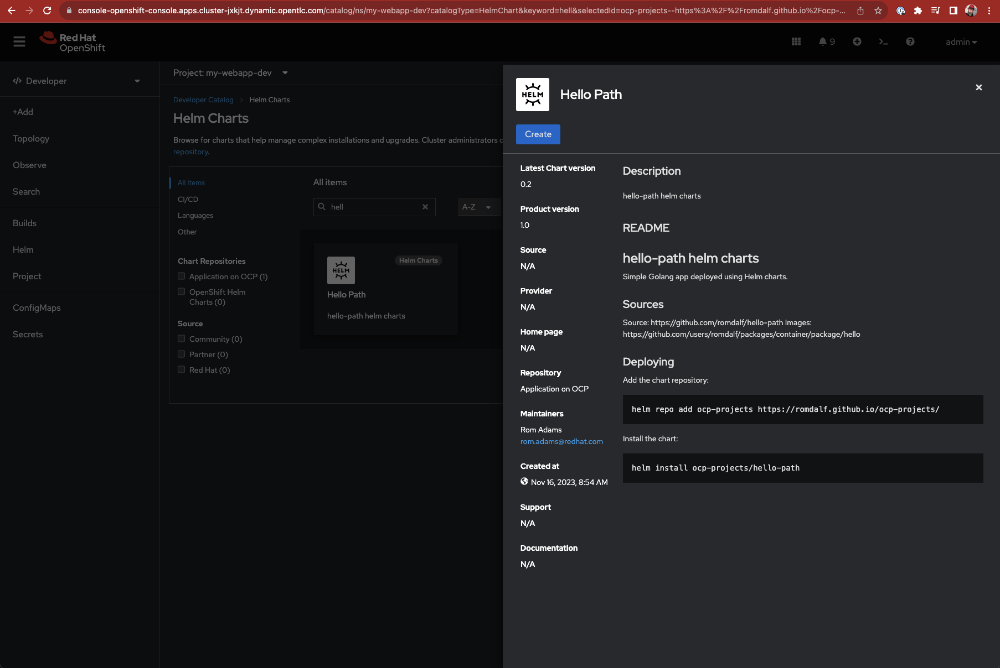
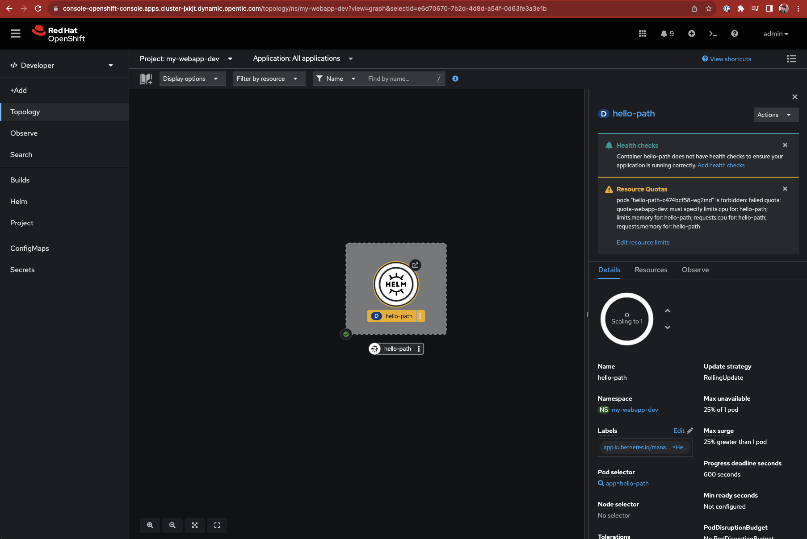
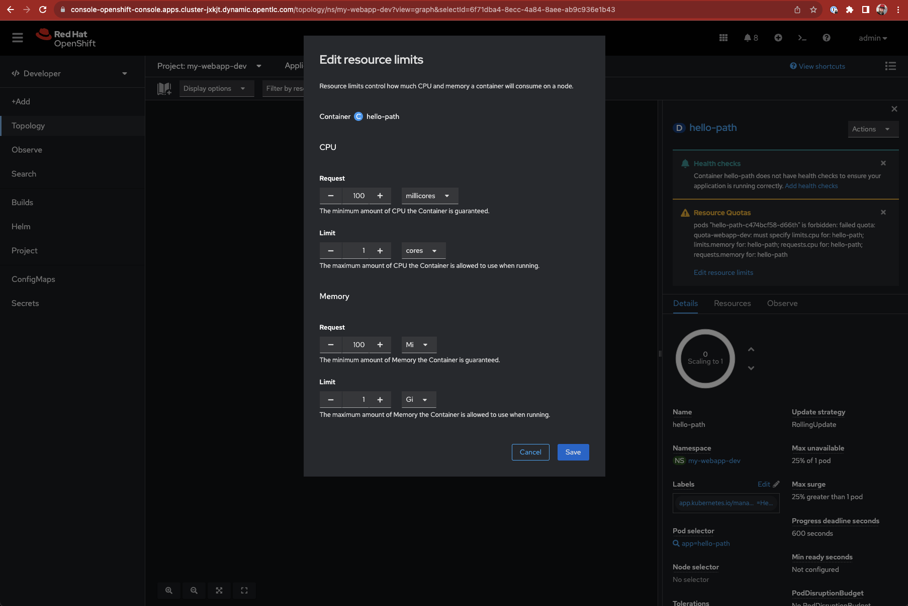
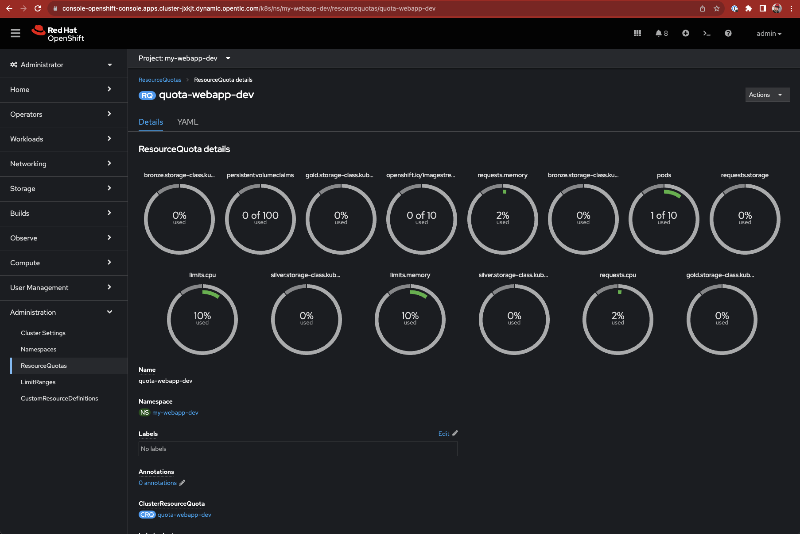

# OpenShift Project Usage
Source code available at [https://romdalf.github.io/ocp-projects/](https://romdalf.github.io/ocp-projects/)

Note that I will refer to "project" instead of "namespace" (original term from Kubernetes) to match the OpenShift terminology. 

## Project
A project is a logical space created on an OpenShift cluster to host one or more pods that will have direct interaction with each other. 
A good example of this would be a web front-end pod and a database pod being deployed within a project called "my-webapp".

```
oc new-project my-webapp --display-name="External web services" --description="External customer facing web service" 
```

```YAML
kind: Project
apiVersion: project.openshift.io/v1
metadata:
  name: my-webapp
  annotations:
    openshift.io/description: External customer facing web service
    openshift.io/display-name: External web services
```

## Use Case

### Full lifecycle
Considering an application lifecycle, and our interest in testing, we can create three projects;   
* ```my-webapp-dev```; where all the development will happen and each pull request from a git perspective will trigger a pipeline to build and deploy a new version of the application.

```YAML
kind: Project
apiVersion: project.openshift.io/v1
metadata:
  name: my-webapp-dev
  annotations:
    openshift.io/description: Development of External customer facing web service
    openshift.io/display-name: DEV EWS
```

* ```my-webapp-tst```; where a release candidate would be deployed and goes through the functional and non-functional testing.

```YAML
kind: Project
apiVersion: project.openshift.io/v1
metadata:
  name: my-webapp-tst
  annotations:
    openshift.io/description: Test environment for External customer facing web service
    openshift.io/display-name: TST EWS
```
  
* ```my-webapp-prd```; where a release candidate has been validated and cut as the next go to release.

```YAML
kind: Project
apiVersion: project.openshift.io/v1
metadata:
  name: my-webapp-prd
  annotations:
    openshift.io/description: Production Environment for External customer facing web service
    openshift.io/display-name: PRD EWS
```

### Quota
We often see that the last stage is hosted on a different platform to guarantee resource availability when dev/test activities are running and could potentially hog compute resources creating turbulences to other application running in production context.  
To avoid this situation, quotas can be put in place to limit the conception of a share platform. 

```YAML
apiVersion: v1
kind: ResourceQuota
metadata:
  name: quota-webapp-dev
  namespace: my-webapp-dev
spec:
  hard:
    openshift.io/imagestreams: '10'
    pods: '10'
    requests.cpu: '5'
    requests.memory: 5Gi
    limits.cpu: '10'
    limits.memory: 10Gi
    requests.storage: 100Gi
    persistentvolumeclaims: '100'
    gold.storage-class.kubernetes.io/requests.storage: 0
    gold.storage-class.kubernetes.io/persistentvolumeclaims: '0'
    silver.storage-class.kubernetes.io/requests.storage: 0
    silver.storage-class.kubernetes.io/persistentvolumeclaims: '0'
    bronze.storage-class.kubernetes.io/requests.storage: 10Gi
    bronze.storage-class.kubernetes.io/persistentvolumeclaims: '100'    
```
The above example established a series of limitations for the project ```my-webapp-dev``` and translated as "you can have":  
* maximum 10 container images
* 10 pods (note this is pods and not containers)
* each pods can request up to 5 CPU and 5Gi
* the total resources is limited to 10 CPU and 10Gi
* storage can be requested for a maximum of 100Gi, split across up to 100 persistent volume claims of, a volume can be max 10Gi, only on the cheapest storage class.

The quota can be monitored via:

GUI:  


CLI:
```
oc describe quota quota-webapp-dev -n my-webapp-dev
```
Output:
```
Name:                                                      quota-webapp-dev
Namespace:                                                 my-webapp-dev
Resource                                                   Used  Hard
--------                                                   ----  ----
bronze.storage-class.kubernetes.io/persistentvolumeclaims  0     100
bronze.storage-class.kubernetes.io/requests.storage        0     10Gi
gold.storage-class.kubernetes.io/persistentvolumeclaims    0     0
gold.storage-class.kubernetes.io/requests.storage          0     0
limits.cpu                                                 0     10
limits.memory                                              0     10Gi
openshift.io/imagestreams                                  0     10
persistentvolumeclaims                                     0     100
pods                                                       0     10
requests.cpu                                               0     5
requests.memory                                            0     5Gi
requests.storage                                           0     100Gi
silver.storage-class.kubernetes.io/persistentvolumeclaims  0     0
silver.storage-class.kubernetes.io/requests.storage        0     0
```

Then, TST and PRD might have a similar quota definition except for the actual limits:
* to avoid TST to hog resources.
* no limits (potentially) for PRD to guarantee continuously scaling capabilities

### Isolation
By default, all pods from any projects can have access to each others. To isolate each project, network policies can be used.  
Here is an example with a flow diagram and the associated configuration:



```yaml
apiVersion: networking.k8s.io/v1
kind: NetworkPolicy
metadata:
  name: netpol-webapp-dev
  namespace: my-webapp-dev
spec:
  podSelector: {}
  policyTypes:
    - Ingress
  ingress:
    - from:
        - ipBlock:
            cidr: 10.20.30.0/24
      ports:
        - port: 443
    - from:
        - podSelector: {}
  egress:
    - to:
        - namespaceSelector: {}
          podSelector:
            matchLabels:
              k8s-app: kube-dns
      ports:
        - port: 53
          protocol: UDP
    - to:
        - ipBlock:
            cidr: 0.0.0.0/0
      ports:
        - port: 443
    - to:
        - podSelector: {}
```
In  a nutshell, the above policy denies all traffic from and to the project space ```my-webapp-dev``` except for:  
- an ingress access from a specific network segment (10.20.30.0/24); like the network on which the developers are working from.
- an egress exit from the cluster on a port 443 to query other services that the application should interact with. This can be reduce using a CIDR definition.
- an access to the internal Kubernetes DNS service to resolve names.

## Deploying Application
Applications can be deployed by multiple way. In this example, we will be using a simple Helm chart as it is the current model. 

In this context, two version of a helm chart for Hello Path have been created; version 0.1 and 0.2, the main difference being the ability to define parameters at the deployment time.
The repository where these charts are hosted will be added within the Helm Developer Catalogue at cluster scope level. Doing so allows access to the helm charts to be deployed in any projects which in our case means ```my-webapp-dev```, ```my-webapp-tst```, ```my-webapp-prd```.

***Within the Developer view***   
Create the Helm Chart repo within OpenShift  


Deploy the application using the Helm Chart catalogue





At this stage, the quota prevents the deployment of the application. Let's edit the limts/requests to carry on with the deployment.




***Within the Administrator view***    
Going back to the quota dashboard, we can see the resource consumption of our application.  



## Testing
First, we might want to differentiate functional and non-functional testing which could lead to different experience or requirements when leveraging the concept of namespace/project. 
