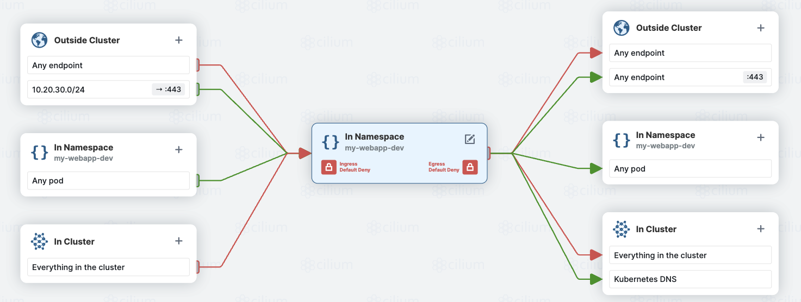

By default, all pods from any projects can have access to each others. To isolate each project, network policies can be used.  
Here is an example with a flow diagram and the associated configuration:



```yaml 
apiVersion: networking.k8s.io/v1
kind: NetworkPolicy
metadata:
  name: netpol-webapp-dev
  namespace: my-webapp-dev
spec:
  podSelector: {}
  policyTypes:
    - Ingress
  ingress:
    - from:
        - ipBlock:
            cidr: 10.20.30.0/24
      ports:
        - port: 443
    - from:
        - podSelector: {}
  egress:
    - to:
        - namespaceSelector: {}
          podSelector:
            matchLabels:
              k8s-app: kube-dns
      ports:
        - port: 53
          protocol: UDP
    - to:
        - ipBlock:
            cidr: 0.0.0.0/0
      ports:
        - port: 443
    - to:
        - podSelector: {}
```
In  a nutshell, the above policy denies all traffic from and to the project space ```my-webapp-dev``` except for:  
- an ingress access from a specific network segment (10.20.30.0/24); like the network on which the developers are working from.
- an egress exit from the cluster on a port 443 to query other services that the application should interact with. This can be reduce using a CIDR definition.
- an access to the internal Kubernetes DNS service to resolve names.

