The source to image deployment approach is an interesting path to learn about the different objects needed to have a working deployment of a test application or during early development. However, it is considered very basic and discouraged for production-grade needs. 

The concept is simple; target the Git repository with the code and let Red Hat OpenShift:

- Figure out the requirement to build the application binary
- Create the container image to run the application binary
- Create a Deployment for the application 
- Configure the service and route to access the application 

In this example, a very simple Golang application [hello-path](https://github.com/romdalf/hello-path) will be used to demonstrate the process. The Git repository only contains the code, no Dockerfile or Kubernetes manifest. 

Here is the code:

```golang
package main

import (
    "fmt"
	"log"
    "net/http"
)

func main() {

	// print the hello message with the URL path 
	http.HandleFunc("/", func(w http.ResponseWriter, r *http.Request) {
        fmt.Fprintf(w, "Hello from URL path: %s\n", r.URL.Path)

		// if URL path is root - propose a test
		if r.URL.Path == "/" {
			fmt.Fprintf(w, "Try to add /partner as a path.")
		}

		// print the URL path at the console
		if r.URL.Path != "/favicon.ico" {
			fmt.Printf("User requested the URL path: %s\n", r.URL.Path)
		}
    })

	// print message at the console
	fmt.Println("Red Hat Partner Meetup BeLux - Hello World")
	fmt.Println("--> Server running on http://localhost:8080")

	// start the service and listen on the given port
    if err := http.ListenAndServe(":8080", nil); err != nil {
		// print error messages at the console
		log.Fatal(err)
	}
}
```

In a nutshell, the service reads the URL's path and prints it back in logs and browser. Let's switch to OCP and get this code deployed! 

***Within the Developer view***    
Click on the "+Add" button and select the "Import from Git"   
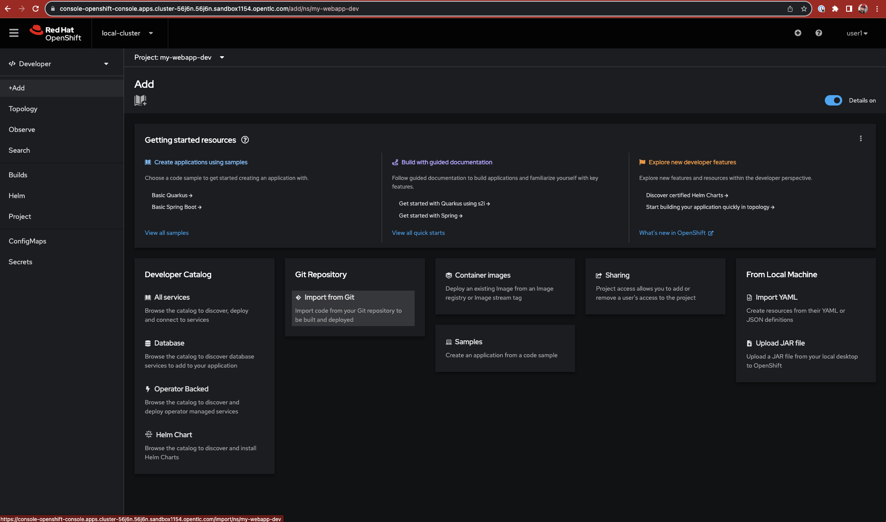    

Get the Git repo URL   
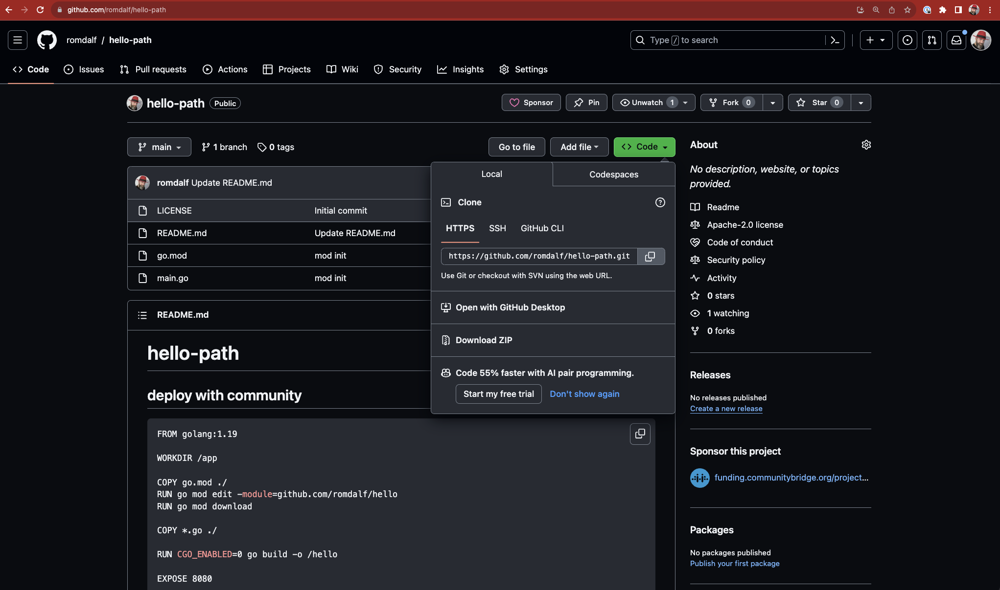    

Insert the Git repo URL in the corresponding field  
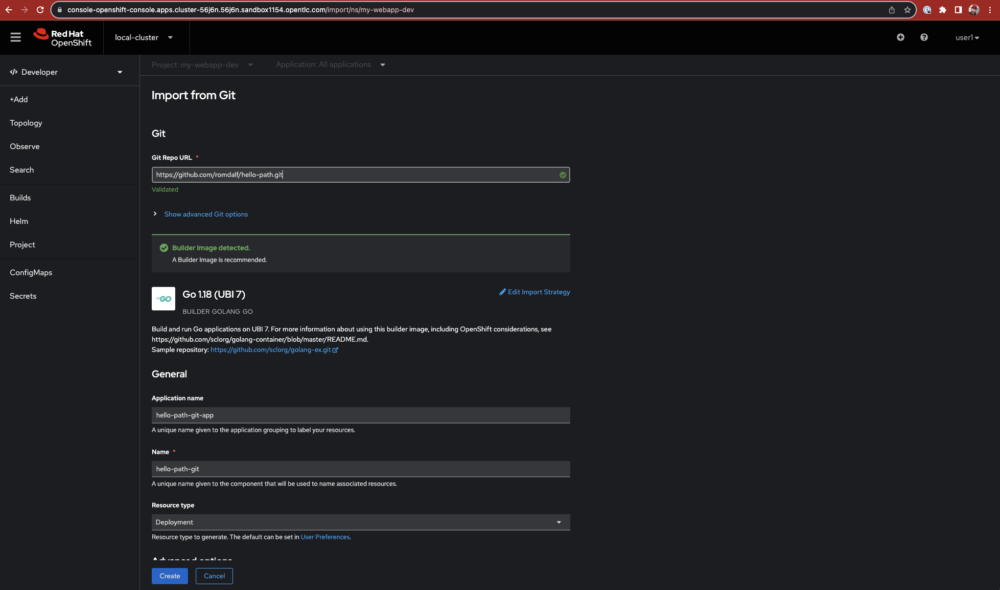   


OCP will preconfigure everything to build and deploy. However, you can still customize everything like the "Import Strategy" and relevant build image and target image: 
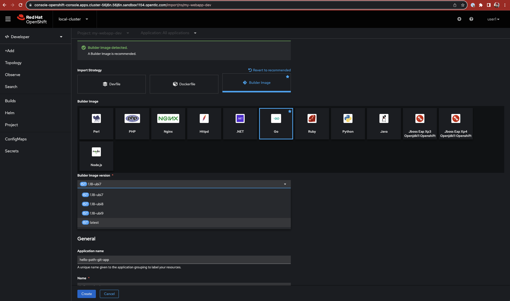    


Clicking create will generate all the needed objects to build, deploy, and access the application.  
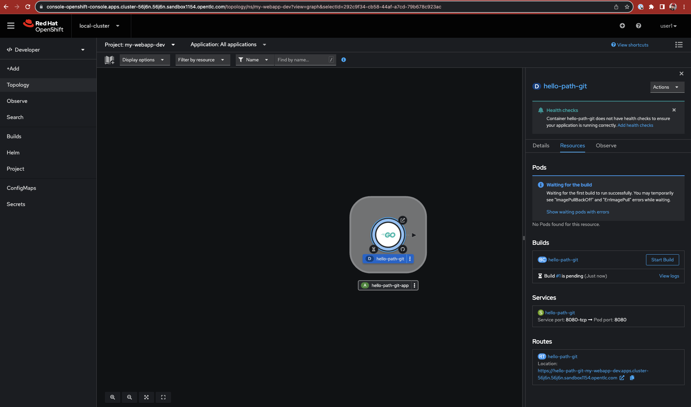   


Build logs can be reviewed live by clicking on the "Go" symbol, and "View logs" within the "Resouces" tab. When finished, a green label will appear to mark the build "Complete"
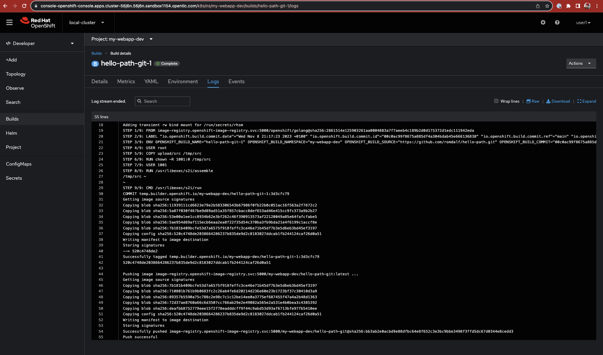   


Returning to the "Topology" tab, click the "Go" symbol, the route for the application is available in the "Resouces" tab. 
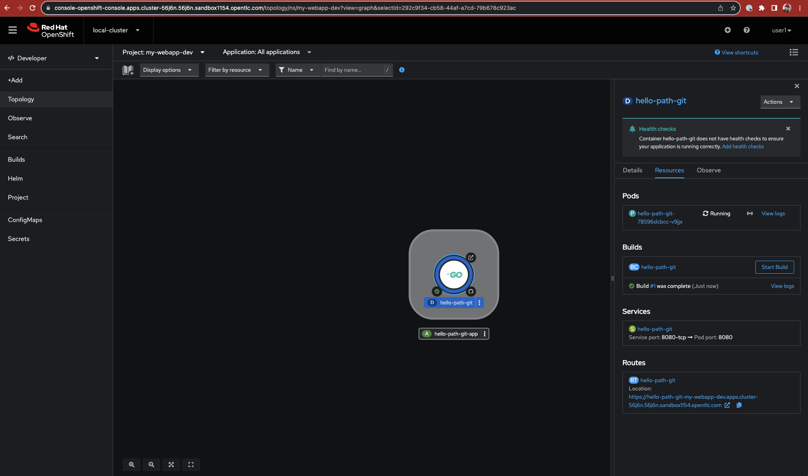   


Modifying the URL by appending "s2i" at the end will print the path both in the browser and the logs.  
   
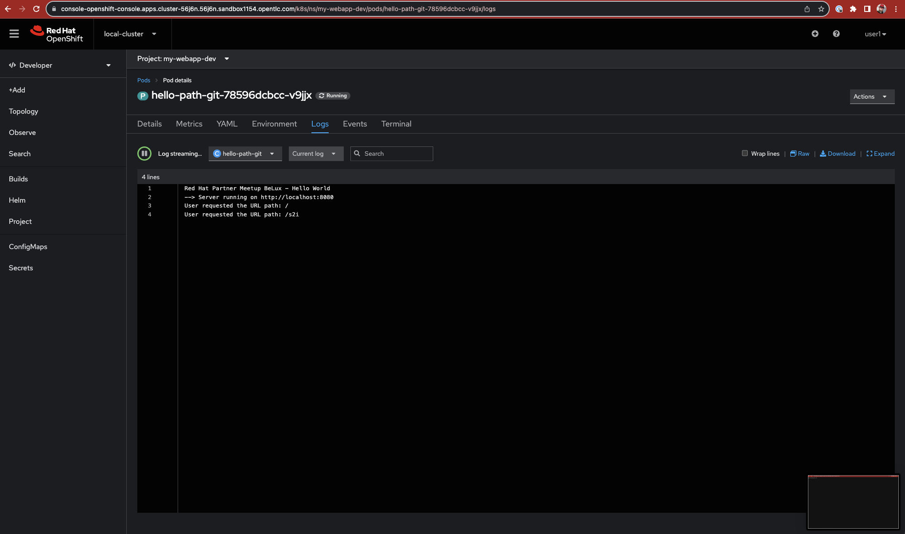   


The "Project" tab provides an overview of all the objects created within the Project,   
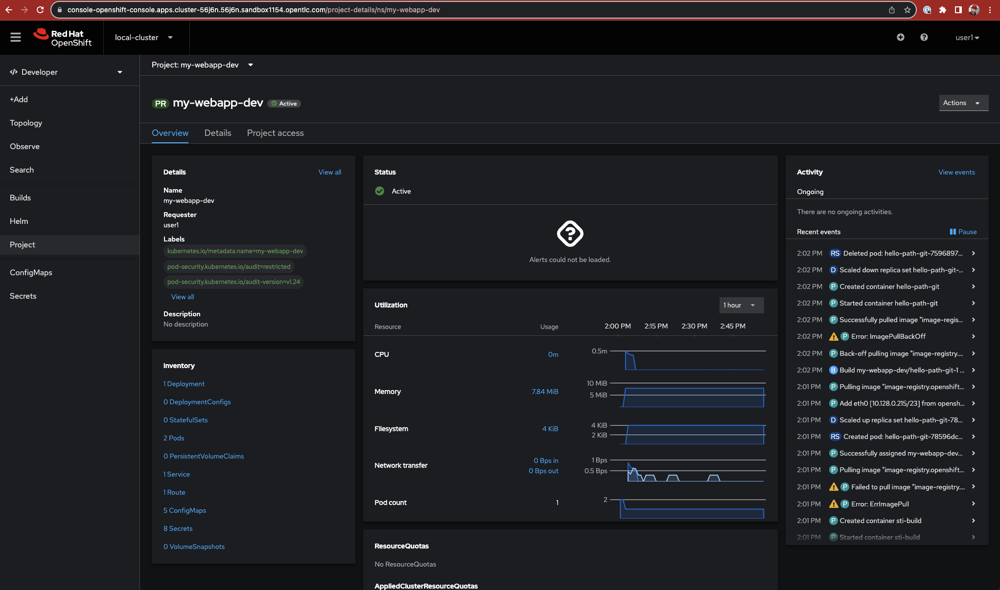   


As an example, the clicking "Service", then exploring the ```hello-path-git``` service object in YAML is a good start to understand how the manifest would look like:   
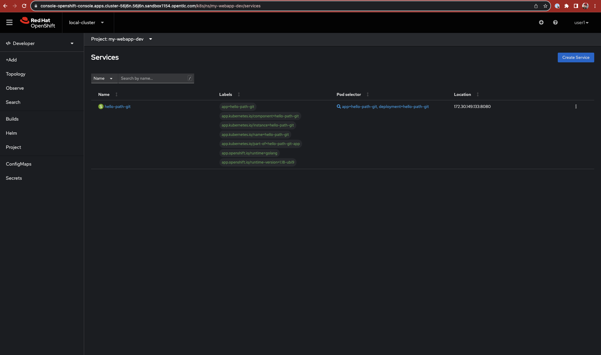   
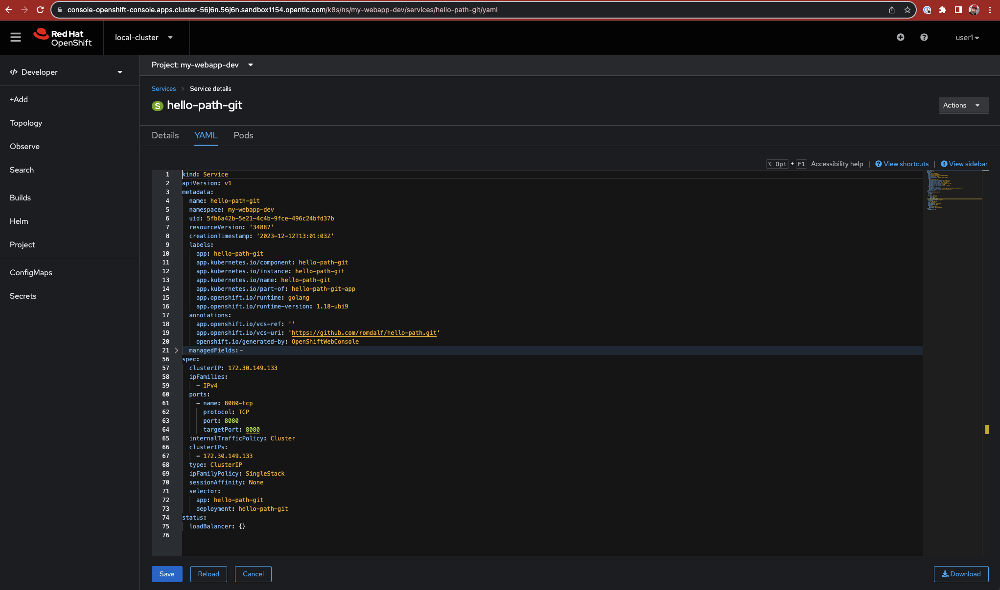   

The below output is a stream down version of the ```Service``` manifest that could be applied to create the relates ```Service``` API object to expose the port 8080:   

```yaml 
kind: Service
apiVersion: v1
metadata:
  name: hello-path-git
  namespace: my-webapp-dev
spec:
  clusterIP: 172.30.149.133
  ipFamilies:
    - IPv4
  ports:
    - name: 8080-tcp
      protocol: TCP
      port: 8080
      targetPort: 8080
  internalTrafficPolicy: Cluster
  clusterIPs:
    - 172.30.149.133
  type: ClusterIP
  ipFamilyPolicy: SingleStack
  sessionAffinity: None
  selector:
    app: hello-path-git
    deployment: hello-path-git
```