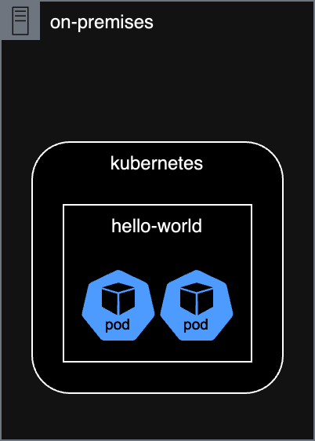
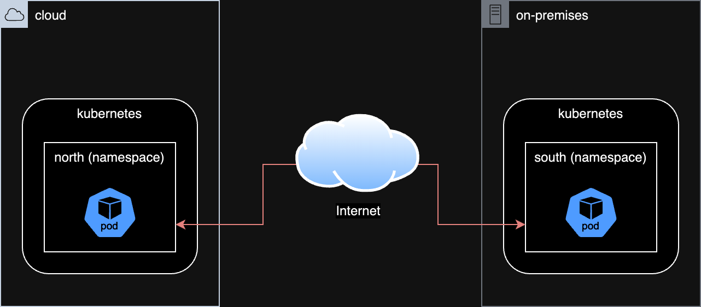

# Multicluster Application Interconnect

## a hybrid cloud story

This demo is leveraging the [skupper example hello world](https://github.com/skupperproject/skupper-example-hello-world) demo to showcase the journey from a development enviroment to a hybrid-cloud deployment. During the walkthrough, the following concepts will be explored:

- how to build a secure container image? or how to include security at the early stage for a frictionless production-grade deployment
- how to deploy applications in a PaaS or even CaaS approach? or how to release in full "gated" autonomy
- how to support split front-end/back-end architecture? or how to leverage the cloud to deploy applications within data sovereignty environment

## requirements

This demo has been prepared for Kubernetes in general, and tested on Red Hat OpenShift for a customers and partners event using the followings: 

- [Red Hat OpenShift Local](https://developers.redhat.com/products/openshift-local/overview) running on a laptop and defined as the on-prem instance
- [Azure Red Hat OpenShift](https://azure.microsoft.com/nl-nl/products/openshift/#overview) - a Microsoft/Red Hat managed OpenShift cluster
- [Skupper](https://skupper.io/) - a multi cloud communication framework for Kubernetes  

However, since OpenShift is a certified Kubernetes distribution, the overall walkthrough should work on any Kubernetes flavor. To that extend, despite using the ```oc``` command, all parameters and arguments have been set to be compatible with ```kubectl```. 

???+ note

    Skupper has been selected in this context to provide a granular connectivity between the front-end and back-end across a secure network.  
    Another solution would be to use Submariner if unifying two cluster at a network level from a scope perspective.  

## running everything locally 



### start OpenShift Local
run:
```bash title="start OpenShift Local"
➜  ~ crc start
```

output: 
```
WARN A new version (2.11.0) has been published on https://developers.redhat.com/content-gateway/file/pub/openshift-v4/clients/crc/2.11.0/crc-macos-installer.pkg 
INFO Checking if running as non-root              
INFO Checking if crc-admin-helper executable is cached 
INFO Checking for obsolete admin-helper executable 
INFO Checking if running on a supported CPU architecture 
INFO Checking minimum RAM requirements            
INFO Checking if crc executable symlink exists    
INFO Checking if running emulated on a M1 CPU     
INFO Checking if vfkit is installed               
INFO Checking if old launchd config for tray and/or daemon exists 
INFO Checking if crc daemon plist file is present and loaded 
INFO Loading bundle: crc_vfkit_4.11.7_amd64...    
CRC requires a pull secret to download content from Red Hat.
You can copy it from the Pull Secret section of https://console.redhat.com/openshift/create/local.
? Please enter the pull secret **************************************************************************************************

INFO Creating CRC VM for openshift 4.11.7...      
INFO Generating new SSH key pair...               
INFO Generating new password for the kubeadmin user 
INFO Starting CRC VM for openshift 4.11.7...      
INFO CRC instance is running with IP 127.0.0.1    
INFO CRC VM is running                            
INFO Updating authorized keys...                  
INFO Check internal and public DNS query...       
INFO Check DNS query from host...                 
INFO Verifying validity of the kubelet certificates... 
INFO Starting kubelet service                     
INFO Waiting for kube-apiserver availability... [takes around 2min] 
INFO Adding user's pull secret to the cluster...  
INFO Updating SSH key to machine config resource... 
INFO Waiting for user's pull secret part of instance disk... 
INFO Changing the password for the kubeadmin user 
INFO Updating cluster ID...                       
INFO Updating root CA cert to admin-kubeconfig-client-ca configmap... 
INFO Starting openshift instance... [waiting for the cluster to stabilize] 
INFO 3 operators are progressing: image-registry, openshift-controller-manager, service-ca 
INFO 3 operators are progressing: image-registry, openshift-controller-manager, service-ca 
INFO 3 operators are progressing: image-registry, openshift-controller-manager, service-ca 
INFO 3 operators are progressing: image-registry, openshift-controller-manager, service-ca 
INFO 2 operators are progressing: image-registry, openshift-controller-manager 
INFO 2 operators are progressing: image-registry, openshift-controller-manager 
INFO Operator openshift-controller-manager is progressing 
INFO Operator openshift-controller-manager is progressing 
INFO Operator openshift-controller-manager is progressing 
INFO Operator openshift-controller-manager is progressing 
INFO All operators are available. Ensuring stability... 
INFO Operators are stable (2/3)...                
INFO Operators are stable (3/3)...                
INFO Adding crc-admin and crc-developer contexts to kubeconfig... 
Started the OpenShift cluster.

The server is accessible via web console at:
  https://console-openshift-console.apps-crc.testing

Log in as administrator:
  Username: kubeadmin
  Password: cKiLy-5umju-GnxbP-Lfqpb

Log in as user:
  Username: developer
  Password: developer

Use the 'oc' command line interface:
  $ eval $(crc oc-env)
  $ oc login -u developer https://api.crc.testing:6443
```

run:
```bash title="log in as admin"
➜  ~ eval $(crc oc-env)
➜  ~ oc login -u kubeadmin https://api.crc.testing:6443
```

output: 
```
Logged into "https://api.crc.testing:6443" as "kubeadmin" using existing credentials.

You have access to 66 projects, the list has been suppressed. You can list all projects with 'oc projects'

Using project "default".
```

### deploy hello-world

run:
```bash title="create a project/namespace"
oc create namespace hello-world
```

output:
```
namespace/hello-world created
```

run:
```bash title="deploy the front-end image within the created project/namespace"
oc create deployment frontend --image ghcr.io/beezy-dev/frontend:2010aba1e1bb5a348fdb498aa75ea97f6e30ee02 -n hello-world
```

output:
```
Warning: would violate PodSecurity "restricted:v1.24": allowPrivilegeEscalation != false (container "frontend" must set securityContext.allowPrivilegeEscalation=false), unrestricted capabilities (container "frontend" must set securityContext.capabilities.drop=["ALL"]), runAsNonRoot != true (pod or container "frontend" must set securityContext.runAsNonRoot=true), seccompProfile (pod or container "frontend" must set securityContext.seccompProfile.type to "RuntimeDefault" or "Localhost")
deployment.apps/frontend created
```

run:
```bash title="deploy the back-end image within the created project/namespace"
oc create deployment backend --image ghcr.io/beezy-dev/backend:2010aba1e1bb5a348fdb498aa75ea97f6e30ee02 -n hello-world
```

output:
```
Warning: would violate PodSecurity "restricted:v1.24": allowPrivilegeEscalation != false (container "backend" must set securityContext.allowPrivilegeEscalation=false), unrestricted capabilities (container "backend" must set securityContext.capabilities.drop=["ALL"]), runAsNonRoot != true (pod or container "backend" must set securityContext.runAsNonRoot=true), seccompProfile (pod or container "backend" must set securityContext.seccompProfile.type to "RuntimeDefault" or "Localhost")
deployment.apps/backend created
```

???+ warning

    why using these tags?   
    why is this message appearing?


run:
```bash title="have a look at the created pods"
oc get pod -n hello-world
```

output:
```
NAME                       READY   STATUS    RESTARTS   AGE
backend-79c4d4676f-7s9kv   1/1     Running   0          76s
frontend-c684c5c45-295hd   1/1     Running   0          92s
```

run: 
```bash title="access the hello-world from localhost with a port-forward"
oc port-forward -n hello-world frontend-c684c5c45-295hd 8080:8080
```

output:
```
Forwarding from 127.0.0.1:8080 -> 8080
Forwarding from [::1]:8080 -> 8080
```

### accessing the application 

Opening http://127.0.0.1:8080 in a browser should provide a web page with a button "Say Hello" and responsding with the back-end pod name. If the page is refresh, the autogenerated name will be updated and sent to the backend too. 


## split deployment

To ease the compliance audit related to our market regulation, our back-end supporting our customer data will be hosted on-prem. 

In this scenario, we would consider the followings:

- the OpenShift Local as an on-prem environement called "south"
- the Azure Red Hat OpenShift as our cloud environement called "north"



### log in and set contexts

```bash title="log in to OpenShift Local and create context"
oc login -u kubeadmin https://api.crc.testing:6443
oc config rename-context $(oc config current-context) local
oc create namespace south 
oc config set-context local --namespace=south 
```

```bash title="log in to ARO and create context"
oc login -u kubeadmin https://api.azhnz6tm.eastus.aroapp.io:6443/
oc config rename-context $(oc config current-context) aro
oc create namespace north
oc config set-context aro --namespace=north
```

### enable skupper 

```bash title="enable skupper" 
oc config use-context aro
skupper init
skupper status
oc config use-context local
skupper init
skupper status
```

output:
``` title="for aro"
Skupper is enabled for namespace "default" in interior mode. It is not connected to any other sites. It has no exposed services.
The site console url is:  https://skupper-default.apps.azhnz6tm.eastus.aroapp.io
The credentials for internal console-auth mode are held in secret: 'skupper-console-users'
```

``` title="for local"
Skupper is enabled for namespace "default" in interior mode. Status pending... It has no exposed services.
The site console url is:  https://skupper-default.apps-crc.testing
The credentials for internal console-auth mode are held in secret: 'skupper-console-users'
```

### link namespace

```bash title="create token for aro"
oc config use-context aro
skupper token create ~/secret.token
```

output:
```
Token written to /Users/rovandep/secret.token 
```

```bash title="link the namespace using the generated token" 
oc config use-context local
skupper link create ~/secret.token
skupper link status
```

output: 
```
Site configured to link to https://claims-default.apps.azhnz6tm.eastus.aroapp.io:443/d57e084e-7654-11ed-9e43-acde48001122 (name=link1)
Check the status of the link using 'skupper link status'.

Links created from this site:
-------------------------------
Link link1 is active

Currently active links from other sites:
----------------------------------------
There are no active links
```

### deploy front-end

run:
```bash title="deploy the front-end image within the created project/namespace"
oc config use-context aro
oc create deployment frontend --image ghcr.io/beezy-dev/frontend:2010aba1e1bb5a348fdb498aa75ea97f6e30ee02 -n north
```

### deploy back-end

run:
```bash title="deploy the back-end image within the created project/namespace"
oc config use-context local
oc create deployment backend --image ghcr.io/beezy-dev/backend:2010aba1e1bb5a348fdb498aa75ea97f6e30ee02 -n south
```

### expose backend service

run:
```bash title="expose service via skupper"
oc config use-context local
skupper expose deployment/backend --port 8080
```

output:
```
deployment backend exposed as backend
``` 


### expose frontend service

run:
```bash title="expose the front-end and back-end"
oc config use-context aro
oc expose deployment/frontend --port 8080 --type LoadBalancer
oc get service/frontend
```

output:
```
NAME       TYPE           CLUSTER-IP       EXTERNAL-IP    PORT(S)          AGE
frontend   LoadBalancer   172.30.155.146   40.88.201.78   8080:30547/TCP   21s
```

Check in a browser:


run:
```bash title="expose the front-end and back-end"
oc config use-context local
oc get pods
```

output:
```
NAME                                          READY   STATUS    RESTARTS   AGE
backend-79c4d4676f-dw99z                      1/1     Running   0          71s
skupper-router-58578d87f8-tbl7m               2/2     Running   0          3m54s
skupper-service-controller-5b8f545d4c-782fx   1/1     Running   0          3m52s
```

### what happen in case of the backend failure

run:
```bash title="delete the backend pod"
oc delete pod backend-79c4d4676f-dw99z
oc get pods
```

output:
```
NAME                                          READY   STATUS    RESTARTS   AGE
backend-79c4d4676f-zrfzc                      1/1     Running   0          3s
skupper-router-58578d87f8-tbl7m               2/2     Running   0          5m16s
skupper-service-controller-5b8f545d4c-782fx   1/1     Running   0          5m14s
```


