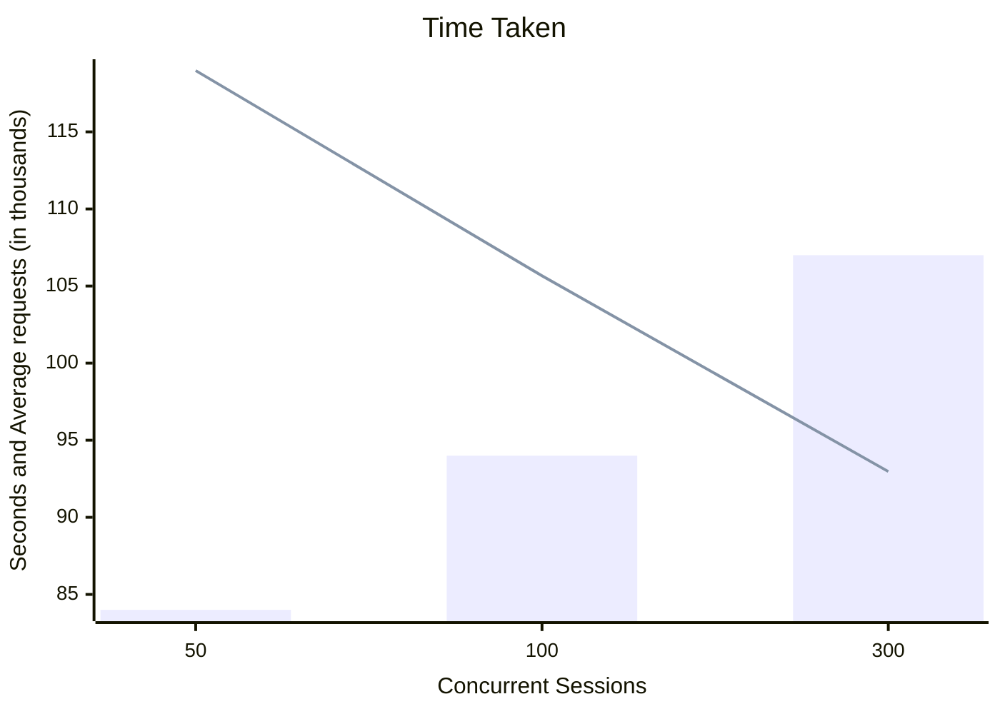

# Benchmarking languages and framework

Working with customers and partners on application modernization projects sparks discussions about governance. This system of rules and practices should influence the choice of language and related framework. However, from a governance and a bias perspective, I highlight the risks of randomly selecting these without performing relevant test case benchmarking. 

Regarding bias, Application teams have their favorite language and framework in mind and will research proof that this was the best option. The Internet is resourceful in supporting opinionated views with a few details about the methodology used. 

Let's take this [article](https://medium.com/deno-the-complete-reference/quarkus-java-vs-gin-go-hello-world-performance-0a2ec6d92078) as a reference. While the overall content provides a sufficient overview for an introduction, it does not help to perform a similar benchmarking within our environment, which will most likely significantly differ from the author. Let's address this missing part as a companion to the article. 

## The article benchmark
From a setup perspective, the author defines the following:  

- The hardware is based on a MacBook Pro M2 with 16GB of RAM
- [Bombardier](https://github.com/codesenberg/bombardier); a HTTP(S) bencharmking tool written in Go(lang)
- Go version 1.21.3; follow [this guide](https://go.dev/doc/install) to install Go on your system
- Quarkus 3.5.1 with Java v21; follow [this guide](https://quarkus.io/get-started/) to install Quarkus on your system

These are a good start; however, the Go code calls from [Gin](https://github.com/gin-gonic/gin), a Go HTTP framework for which we don't have any version reference. The same goes for Bombardier.

### Code
The below code is the as-is output from the article. These are the traditional ```hello world``` examples to showcase languages and easily compare them. Even with years of development experience, anyone needed more to run the code from an unknown language and benchmark it.

The code is also available within this repository within ```docs/sources/hello-world-article``` in the following subdirectories:   

- ```hello-world-go``` the ready to use Go code
- ```hello-world-quarkus``` the ready to use Quarkus code


#### Go/Gin   

```go title="The Go code from the article"
--8<-- "sources/hello-world-article/hello-world-go/main.go"
```

Here the steps to run this code:

- Open two terminal consoles
- Create a directory like ```hello-world-go``` and ```cd``` in the directory
- Create a file called ```main.go``` and copy the above code in
- Initialize the module(s) for the project:  

```
go mod init hello-world-go
```
This will create a file called ```go.mod``` with the following content: 

```
--8<-- "sources/hello-world-article/hello-world-go/go.mod"
```

- Check for missing modules:

```
go mod tidy
```
This will create a file called ```go.sum``` with the following content:

```
--8<-- "sources/hello-world-article/hello-world-go/go.sum"
```

- In one of the console, run the code:

```
go run main.go
```

Resulting in the following output:

```
[GIN-debug] [WARNING] Running in "debug" mode. Switch to "release" mode in production.
 - using env:   export GIN_MODE=release
 - using code:  gin.SetMode(gin.ReleaseMode)

[GIN-debug] GET    /                         --> main.main.func1 (1 handlers)
[GIN-debug] [WARNING] You trusted all proxies, this is NOT safe. We recommend you to set a value.
Please check https://pkg.go.dev/github.com/gin-gonic/gin#readme-don-t-trust-all-proxies for details.
[GIN-debug] Listening and serving HTTP on :3000
```

- In a second console, use ```curl``` to check the service:

```
curl localhost:3000
```

Resulting in the following output: 
```
Hello world!% 
```

***Note that there is no output logged into the first console where the service is running.***

- The code seems to be working, we can build a binary:

```
go build -o hello-world main.go
```

Resulting in the creating a binary called ```hello-world``` with the following size:

```
-rwxr-xr-x   1 romdalf  staff   9.5M Dec 25 10:32 hello-world
```

- Finally, to run the binary:

```
./hello-world
```
Resulting in the following output:

```
[GIN-debug] [WARNING] Running in "debug" mode. Switch to "release" mode in production.
 - using env:   export GIN_MODE=release
 - using code:  gin.SetMode(gin.ReleaseMode)

[GIN-debug] GET    /                         --> main.main.func1 (1 handlers)
[GIN-debug] [WARNING] You trusted all proxies, this is NOT safe. We recommend you to set a value.
Please check https://pkg.go.dev/github.com/gin-gonic/gin#readme-don-t-trust-all-proxies for details.
[GIN-debug] Listening and serving HTTP on :3000
```


#### Quarkus   

```java title="The Java/Quarkus code from the article"
--8<-- "sources/hello-world-article/hello-world-quarkus/src/main/java/org/acme/HelloWorldApplication.java"
```

Here are the steps to run this code:   

- Open two terminal consoles
- Create a Quarkus project and ```cd``` in the directory:

```
quarkus create app org.acme:hello-world-quarkus
```

Resulting in the following output:

```
-----------

applying codestarts...
📚 java
🔨 maven
📦 quarkus
📝 config-properties
🔧 tooling-dockerfiles
🔧 tooling-maven-wrapper
🚀 resteasy-reactive-codestart

-----------
[SUCCESS] ✅  quarkus project has been successfully generated in:
--> /Users/romdalf/dev/hello-world-quarkus
-----------
Navigate into this directory and get started: quarkus dev
```

- Edit the file ```src/main/java/org/acme/GreetingResource.java``` to replace the code with the article one (see above)
- Rename the file ```src/main/java/org/acme/GreetingResource.java```to ```src/main/java/org/acme/HelloWorldApplication.java```:

```
mv src/main/java/org/acme/GreetingResource.java src/main/java/org/acme/HelloWorldApplication.java
```

***Note: the ```classname``` needs to match the filename.*** 

- Remove the default ```resources``` directory:

```
rm -rf src/main/resources/
```

- In onf of the console, run the code:

```
quarkus dev
```

Resulting in the following output:

```
[INFO] Scanning for projects...
[INFO] 
[INFO] --------------------< org.acme:hello-world-quarkus >--------------------
[INFO] Building hello-world-quarkus 1.0.0-SNAPSHOT
[INFO]   from pom.xml
[INFO] --------------------------------[ jar ]---------------------------------
[INFO] 
[INFO] --- quarkus:3.6.4:dev (default-cli) @ hello-world-quarkus ---
[INFO] Invoking resources:3.3.1:resources (default-resources) @ hello-world-quarkus
[INFO] skip non existing resourceDirectory /Users/romdalf/dev/hello-world-quarkus/src/main/resources
[INFO] Invoking quarkus:3.6.4:generate-code (default) @ hello-world-quarkus
[INFO] Invoking compiler:3.11.0:compile (default-compile) @ hello-world-quarkus
[INFO] Changes detected - recompiling the module! :source
[INFO] Compiling 1 source file with javac [debug release 21] to target/classes
[INFO] Annotation processing is enabled because one or more processors were found
  on the class path. A future release of javac may disable annotation processing
  unless at least one processor is specified by name (-processor), or a search
  path is specified (--processor-path, --processor-module-path), or annotation
  processing is enabled explicitly (-proc:only, -proc:full).
  Use -Xlint:-options to suppress this message.
  Use -proc:none to disable annotation processing.
[INFO] Invoking resources:3.3.1:testResources (default-testResources) @ hello-world-quarkus
[INFO] skip non existing resourceDirectory /Users/romdalf/dev/hello-world-quarkus/src/test/resources
[INFO] Invoking quarkus:3.6.4:generate-code-tests (default) @ hello-world-quarkus
[INFO] Invoking compiler:3.11.0:testCompile (default-testCompile) @ hello-world-quarkus
[INFO] Changes detected - recompiling the module! :dependency
[INFO] Compiling 2 source files with javac [debug release 21] to target/test-classes
[INFO] Annotation processing is enabled because one or more processors were found
  on the class path. A future release of javac may disable annotation processing
  unless at least one processor is specified by name (-processor), or a search
  path is specified (--processor-path, --processor-module-path), or annotation
  processing is enabled explicitly (-proc:only, -proc:full).
  Use -Xlint:-options to suppress this message.
  Use -proc:none to disable annotation processing.
Listening for transport dt_socket at address: 5005
__  ____  __  _____   ___  __ ____  ______ 
 --/ __ \/ / / / _ | / _ \/ //_/ / / / __/ 
 -/ /_/ / /_/ / __ |/ , _/ ,< / /_/ /\ \   
--\___\_\____/_/ |_/_/|_/_/|_|\____/___/   
2023-12-25 11:05:17,735 INFO  [io.quarkus] (Quarkus Main Thread) hello-world-quarkus 1.0.0-SNAPSHOT on JVM (powered by Quarkus 3.6.4) started in 1.076s. Listening on: http://localhost:8080

2023-12-25 11:05:17,737 INFO  [io.quarkus] (Quarkus Main Thread) Profile dev activated. Live Coding activated.
2023-12-25 11:05:17,738 INFO  [io.quarkus] (Quarkus Main Thread) Installed features: [cdi, resteasy-reactive, smallrye-context-propagation, vertx]
``` 

- In a second console, use ```curl``` to check the service:

```
curl localhost:8000
```

Resulting in the following output:
```
Hello World!%
```

***Note that there is no output logged into the first console where the service is running.***

- The code seems to be working, we can build a binary:

```
quarkus build
```

Resulting in a error linked to the test suites:
```
2023-12-25 11:10:08,561 INFO  [io.quarkus] (main) hello-world-quarkus stopped in 0.014s
[INFO] 
[INFO] Results:
[INFO] 
[ERROR] Failures: 
[ERROR]   GreetingResourceTest.testHelloEndpoint:16 1 expectation failed.
Expected status code <200> but was <404>.

[INFO] 
[ERROR] Tests run: 1, Failures: 1, Errors: 0, Skipped: 0
[INFO] 
[INFO] ------------------------------------------------------------------------
[INFO] BUILD FAILURE
[INFO] ------------------------------------------------------------------------
[INFO] Total time:  5.915 s
[INFO] Finished at: 2023-12-25T11:10:08+01:00
[INFO] ------------------------------------------------------------------------
```

- Rename the test files:

```
mv src/test/java/org/acme/GreetingResourceIT.java src/test/java/org/acme/HelloWorldApplicationIT.java
mv src/test/java/org/acme/GreetingResourceTest.java src/test/java/org/acme/HelloWorldApplicationTest.java
```

- Adapt the content of each test files like: 

```java title="src/test/java/org/acme/HelloWorldApplicationIT.java"
--8<-- "sources/hello-world-article/hello-world-quarkus/src/test/java/org/acme/HelloWorldApplicationIT.java"
```

```java title="src/test/java/org/acme/HelloWorldApplicationTest.java"
--8<-- "sources/hello-world-article/hello-world-quarkus/src/test/java/org/acme/HelloWorldApplicationTest.java"
```

- Delete the ```target``` directory and build agan:

```
rm -rf target
quarkus build
```

Resulting in the following output:
```
[INFO] Scanning for projects...
[INFO] 
[INFO] --------------------< org.acme:hello-world-quarkus >--------------------
[INFO] Building hello-world-quarkus 1.0.0-SNAPSHOT
[INFO]   from pom.xml
[INFO] --------------------------------[ jar ]---------------------------------
[INFO] 
[INFO] --- resources:3.3.1:resources (default-resources) @ hello-world-quarkus ---
[INFO] skip non existing resourceDirectory /Users/romdalf/dev/hello-world-quarkus/src/main/resources
[INFO] 
[INFO] --- quarkus:3.6.4:generate-code (default) @ hello-world-quarkus ---
[INFO] 
[INFO] --- compiler:3.11.0:compile (default-compile) @ hello-world-quarkus ---
[INFO] Changes detected - recompiling the module! :source
[INFO] Compiling 1 source file with javac [debug release 21] to target/classes
[INFO] 
[INFO] --- quarkus:3.6.4:generate-code-tests (default) @ hello-world-quarkus ---
[INFO] 
[INFO] --- resources:3.3.1:testResources (default-testResources) @ hello-world-quarkus ---
[INFO] skip non existing resourceDirectory /Users/romdalf/dev/hello-world-quarkus/src/test/resources
[INFO] 
[INFO] --- compiler:3.11.0:testCompile (default-testCompile) @ hello-world-quarkus ---
[INFO] Changes detected - recompiling the module! :dependency
[INFO] Compiling 2 source files with javac [debug release 21] to target/test-classes
[INFO] Annotation processing is enabled because one or more processors were found
  on the class path. A future release of javac may disable annotation processing
  unless at least one processor is specified by name (-processor), or a search
  path is specified (--processor-path, --processor-module-path), or annotation
  processing is enabled explicitly (-proc:only, -proc:full).
  Use -Xlint:-options to suppress this message.
  Use -proc:none to disable annotation processing.
[INFO] 
[INFO] --- surefire:3.1.2:test (default-test) @ hello-world-quarkus ---
[INFO] Using auto detected provider org.apache.maven.surefire.junitplatform.JUnitPlatformProvider
[INFO] 
[INFO] -------------------------------------------------------
[INFO]  T E S T S
[INFO] -------------------------------------------------------
[INFO] Running org.acme.HelloWorldApplicationTest
2023-12-25 11:19:08,017 INFO  [io.quarkus] (main) hello-world-quarkus 1.0.0-SNAPSHOT on JVM (powered by Quarkus 3.6.4) started in 0.994s. Listening on: http://localhost:8081
2023-12-25 11:19:08,017 INFO  [io.quarkus] (main) Profile test activated. 
2023-12-25 11:19:08,018 INFO  [io.quarkus] (main) Installed features: [cdi, resteasy-reactive, smallrye-context-propagation, vertx]
[INFO] Tests run: 1, Failures: 0, Errors: 0, Skipped: 0, Time elapsed: 2.769 s -- in org.acme.HelloWorldApplicationTest
2023-12-25 11:19:08,588 INFO  [io.quarkus] (main) hello-world-quarkus stopped in 0.012s
[INFO] 
[INFO] Results:
[INFO] 
[INFO] Tests run: 1, Failures: 0, Errors: 0, Skipped: 0
[INFO] 
[INFO] 
[INFO] --- jar:3.3.0:jar (default-jar) @ hello-world-quarkus ---
[INFO] Building jar: /Users/romdalf/dev/hello-world-quarkus/target/hello-world-quarkus-1.0.0-SNAPSHOT.jar
[INFO] 
[INFO] --- quarkus:3.6.4:build (default) @ hello-world-quarkus ---
[INFO] [io.quarkus.deployment.QuarkusAugmentor] Quarkus augmentation completed in 750ms
[INFO] 
[INFO] --- failsafe:3.1.2:integration-test (default) @ hello-world-quarkus ---
[INFO] Tests are skipped.
[INFO] 
[INFO] --- failsafe:3.1.2:verify (default) @ hello-world-quarkus ---
[INFO] Tests are skipped.
[INFO] 
[INFO] --- install:3.1.1:install (default-install) @ hello-world-quarkus ---
[INFO] Installing /Users/romdalf/dev/hello-world-quarkus/pom.xml to /Users/romdalf/.m2/repository/org/acme/hello-world-quarkus/1.0.0-SNAPSHOT/hello-world-quarkus-1.0.0-SNAPSHOT.pom
[INFO] Installing /Users/romdalf/dev/hello-world-quarkus/target/hello-world-quarkus-1.0.0-SNAPSHOT.jar to /Users/romdalf/.m2/repository/org/acme/hello-world-quarkus/1.0.0-SNAPSHOT/hello-world-quarkus-1.0.0-SNAPSHOT.jar
[INFO] ------------------------------------------------------------------------
[INFO] BUILD SUCCESS
[INFO] ------------------------------------------------------------------------
[INFO] Total time:  6.686 s
[INFO] Finished at: 2023-12-25T11:19:09+01:00
[INFO] ------------------------------------------------------------------------
```

- Finally, to run the JAR:

```
java -jar target/quarkus-app/quarkus-run.jar
```

Resulting in the following output:
```
__  ____  __  _____   ___  __ ____  ______ 
 --/ __ \/ / / / _ | / _ \/ //_/ / / / __/ 
 -/ /_/ / /_/ / __ |/ , _/ ,< / /_/ /\ \   
--\___\_\____/_/ |_/_/|_/_/|_|\____/___/   
2023-12-25 11:22:35,496 INFO  [io.quarkus] (main) hello-world-quarkus 1.0.0-SNAPSHOT on JVM (powered by Quarkus 3.6.4) started in 0.636s. Listening on: http://0.0.0.0:8080
2023-12-25 11:22:35,501 INFO  [io.quarkus] (main) Profile prod activated. 
2023-12-25 11:22:35,502 INFO  [io.quarkus] (main) Installed features: [cdi, resteasy-reactive, smallrye-context-propagation, vertx]
```

### Benchmarks

Based on the article, we don't have the overall process to perform the benchmarks. However, there is some specific parameters that are shared:

- Bombardier is the tool; in my case the binary is ```bombardier-darwin-arm64``` and needs to be adapted to your specific environment
- About 10 million requests were executed
- Different concurrency scenarios were used; 50, 100, and 300

According to Bombardier repository, the following commands would represent the above parameters:

``` title="Benchmarks for Go/Gin"
./bombardier-darwin-arm64 -c 50 -n 10000000 http://localhost:3000
./bombardier-darwin-arm64 -c 100 -n 10000000 http://localhost:3000
./bombardier-darwin-arm64 -c 300 -n 10000000 http://localhost:3000
```





